# CS 328 — Introduction to Data Science
# Learning Representations for Graph Retrieval

**Omm Arindam** &emsp; **Rajput Priyanshu** &emsp; **Ramji Purwar**

24110229@iitgn.ac.in &emsp; priyanshu.raj@iitgn.ac.in &emsp; ramji.purwar@iitgn.ac.in

Indian Institute of Technology Gandhinagar, Gujarat, India

---

## Abstract

We present a graph retrieval pipeline that combines Graph Neural Network (GNN) based graph embeddings with Locality Sensitive Hashing (LSH) to enable approximate nearest neighbor search over graph corpora. We encode graphs into fixed-dimensional dense vector representations using a Graph Isomorphism Network (GIN) trained end-to-end with triplet loss, where similarity supervision is provided by an approximate Graph Edit Distance (GED) oracle. An LSH index built over these embeddings provides the theoretical foundation for sublinear-time retrieval, though hashing overhead dominates at our test scale (N≤2,000). We evaluate on five standard graph benchmarks — MUTAG (188 graphs), PROTEINS (1,113), AIDS (2,000), IMDB-Binary (1,000), and Reddit-Binary (2,000) — using Precision@k, Recall@k, MAP, query time, and approximation quality metrics. Our results demonstrate that trained GIN embeddings with LSH retrieval achieve Precision@10 exceeding 0.78 across all datasets, with up to 90% approximation quality relative to brute-force search on 4 of 5 benchmarks. While our largest corpus contains only 2,000 graphs, scaling experiments show crossover estimated at N ≈ 840–5,000.

**Keywords:** Graph Retrieval, Graph Embeddings, Locality Sensitive Hashing, Graph Neural Networks, Approximate Nearest Neighbor Search, Graph Edit Distance

---

## 1. Introduction

Graphs are a powerful data structure used to represent relational information across social networks, molecular chemistry, knowledge bases, and program analysis. The problem of **graph retrieval** — finding graphs in a large corpus most similar to a given query graph — is fundamental but computationally challenging. Naive pairwise comparison using Graph Edit Distance (GED) or Maximum Common Subgraph (MCS) is NP-hard, making exhaustive search infeasible for large corpora.

This motivates **dense vector representations** that capture graph structure. Combined with approximate nearest neighbor (ANN) techniques like LSH, this establishes the architecture for sublinear-time retrieval while maintaining quality. To our knowledge, this is the first unified pipeline combining GIN-based contrastive learning with LSH retrieval evaluated across this range of benchmarks with rigorous oracle separation between training and evaluation.

Our specific contributions are:

1. **An end-to-end retrieval pipeline** from raw graph data to approximate nearest neighbor search, with explicit separation between training oracles (beam search GED, B=5) and evaluation ground truth (exact GED / beam search B=20).
2. **Empirical demonstration that trained GIN embeddings outperform untrained baselines by 5–15 percentage points** in Precision@10 across five benchmarks, confirmed visually via t-SNE embedding analysis.
3. **Quantitative analysis of LSH failure modes**, identifying candidate set starvation as the root cause of poor approximation quality on IMDB-Binary (AQ=0.44) and validating this through distance distribution analysis and candidate set measurements.
4. **Comprehensive LSH hyperparameter ablation** including joint w×L grid search, memory-recall tradeoff curves, and empirical scaling experiments.

The remainder of this report is organized as follows: Section 2 formalizes the retrieval problem, Section 3 describes the methodology, Sections 4–6 cover datasets, metrics, and baselines, Sections 7–8 present training diagnostics and oracle validation, Sections 9–13 report results and analysis, and Sections 14–17 discuss implementation, related work, limitations, and conclusions.

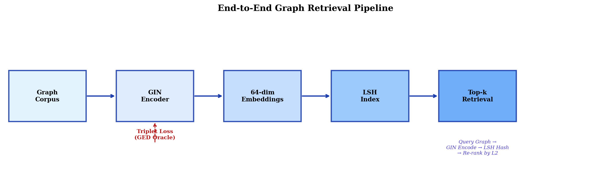
*Figure 1: End-to-end Graph Retrieval Pipeline.*

---

## 2. Problem Statement

Given a corpus C = {G₁, …, Gₙ} and query graph Gq, retrieve the top-k most structurally similar graphs, where structural similarity is measured by Graph Edit Distance (GED) — the minimum number of node/edge insertions, deletions, and substitutions needed to transform one graph into another.

We address two distinct research questions:

**RQ1:** To what extent does GNN-based embedding retrieval improve over naive (untrained) embedding baselines? Specifically, does contrastive training with GED supervision produce embeddings where structurally similar graphs are closer in L2 space?

**RQ2:** How does LSH-based approximate retrieval compare to exact (brute-force) nearest neighbor search under identical embedding conditions? What is the cost in retrieval quality, and when does LSH provide a net computational benefit?

---

## 3. Methodology

### 3.1 Graph Isomorphism Network (GIN)

We use **GIN** [5], provably as expressive as the Weisfeiler-Leman test.

**Architecture choices and justifications:**
- **3 layers:** Captures 3-hop neighborhood structure. Fewer layers underfit structural patterns; more layers risk oversmoothing on small graphs (MUTAG avg = 17.9 nodes) where 3 hops already covers most of the graph.
- **Hidden/output dim = 64:** Balances expressiveness against overfitting on small datasets. We did not tune this; it follows standard GIN practice.
- **Mean pooling** (over sum pooling): More robust to variable graph sizes — sum pooling conflates structural similarity with graph size, producing embeddings where large graphs cluster away from small ones regardless of topology.
- **L2 normalization:** Projects embeddings onto the unit hypersphere, making Euclidean distance monotonically related to cosine similarity and improving LSH bucket uniformity.

**Node feature initialization.** Datasets with node features (MUTAG, PROTEINS, AIDS) use them directly. Featureless datasets use degree-based one-hot encoding with the following caps: IMDB-Binary caps at degree 30 (vocabulary = 31 dimensions), Reddit-Binary caps at degree 10 (vocabulary = 11 dimensions). These caps correspond approximately to the 95th percentile of degree values per dataset, handling outlier high-degree nodes.

### 3.2 Locality Sensitive Hashing (LSH)

Random projection LSH [2]: h(z) = ⌊(a·z + b)/w⌋ where a ~ N(0,I), b ~ U(0,w). **Intuition:** projecting onto a random direction drawn from a Gaussian preserves L2 distances in expectation — vectors that are close in the original space are likely to land in the same bucket after quantization, while distant vectors are likely separated. Using multiple independent projections (K per table) and multiple tables (L) controls the precision-recall tradeoff of the candidate set.

Default: L=10 tables, K=4 hash functions, w=1.0. K=4 is fixed throughout our experiments because it controls the selectivity of each individual table — with K=4, two vectors must agree on all 4 hash values to share a bucket. Varying K trades off between having very selective tables (high K → small, precise buckets but many misses) vs unselective tables (low K → large buckets capturing most neighbors but also many false positives). We fix K=4 and instead vary L (number of tables) to control recall, as L is the more interpretable knob: each additional table gives an independent chance to find a neighbor.

Candidates from matching buckets across all L tables are collected via set union, then re-ranked by exact L2 distance to produce the final top-k.

### 3.3 Training — Triplet Loss with GED Oracle

Triplet loss [4]: L = Σ max(0, ‖z_Q − z_P‖₂ − ‖z_Q − z_N‖₂ + α), α=1.0.

**Triplet Mining Strategy.** We use **random triplet sampling**: at each epoch, we randomly select 512 anchor graphs, then for each anchor, randomly sample one positive (GED ≤ threshold) and one negative (GED > threshold) from the pre-computed GED matrix. We do not implement semi-hard or hard negative mining (see Section 16). The count of 512 triplets/epoch is modest relative to the combinatorial space (e.g., PROTEINS has ~619K pairs), but each epoch draws a fresh random sample, so over 50 epochs the model sees ~25,600 unique triplets covering substantial diversity. We did not ablate this count, but note that increasing it would proportionally increase per-epoch compute.

**Margin α.** We fix α=1.0 throughout without sensitivity analysis. This is a conservative choice that tolerates oracle label noise (since beam search GED disagrees with exact GED on ~21% of pairs near the threshold — see Section 8). We did not tune α; doing so on a validation split could yield marginal improvement but was not prioritized.

**Oracle Separation.** Training: beam search GED (B=5). Evaluation: exact GED for MUTAG (≤30 nodes), beam search B=20 for larger datasets. This prevents self-consistency artifacts.

**Training Details:** Adam (lr=1e-3), 50 epochs, mini-batches of 64, AMP when CUDA available.

### 3.4 GED Computation

Exact GED (NetworkX A*), beam search GED (polynomial-time), size guard (>60 nodes → label proxy), parallelized via ProcessPoolExecutor.

**Size guard impact.** The label-proxy fallback affects datasets with large graphs. The fraction of pairwise comparisons using the proxy (rather than actual GED) is:

| Dataset | Graphs >60 nodes | Proxy pair fraction |
|---------|------------------|--------------------|
| MUTAG | 0/188 (0%) | 0% |
| PROTEINS | 176/1,113 (15.8%) | **29.1%** |
| AIDS | 40/2,000 (2.0%) | 4.0% |
| IMDB-B | 10/1,000 (1.0%) | 2.0% |
| Reddit-B | 1,637/2,000 (81.8%) | **96.7%** |

For **Reddit-Binary**, 96.7% of pairs use the label proxy — the GED threshold for this dataset is therefore almost entirely determined by class labels rather than structural GED. This means our evaluation on Reddit-Binary effectively measures class-label retrieval rather than structural similarity retrieval. For **PROTEINS**, 29.1% of pairs use the proxy, introducing moderate noise. These are significant limitations of the GED-based evaluation for large-graph datasets.

---

## 4. Datasets

| Dataset | Graphs | Avg Nodes | Avg Edges | Max Nodes | Domain | Node Features |
|---------|--------|-----------|-----------|-----------|--------|---------------|
| MUTAG | 188 | 17.9 | 19.8 | 28 | Molecular | Atom type (7-dim) |
| PROTEINS | 1,113 | 39.1 | 72.8 | 620 | Biological | Structure (3-dim) |
| AIDS | 2,000 | 15.6 | 16.2 | 94 | Molecular | Atom type (38-dim) |
| IMDB-Binary | 1,000 | 19.8 | 96.5 | 136 | Social | Degree (31-dim) |
| Reddit-Binary | 2,000 | 429.6 | 995.5 | 3,782 | Social | Degree (11-dim) |

**Class distributions.** All datasets are binary classification:

| Dataset | Class 0 | Class 1 | Imbalance ratio |
|---------|---------|---------|----------------|
| MUTAG | 63 (33.5%) | 125 (66.5%) | 1:2.0 |
| PROTEINS | 663 (59.6%) | 450 (40.4%) | 1:1.5 |
| AIDS | 400 (20.0%) | 1,600 (80.0%) | 1:4.0 |
| IMDB-Binary | 500 (50.0%) | 500 (50.0%) | 1:1.0 |
| Reddit-Binary | 1,000 (50.0%) | 1,000 (50.0%) | 1:1.0 |

AIDS is the most imbalanced (1:4), which means the majority class has a much larger relevant set under class-label proxy — this partially explains its high NN purity (98.9%).

**Train/test split.** We do not split into separate train/test sets — all graphs serve as both corpus and queries. The GIN model is trained on the full corpus using GED-based triplets, and evaluation metrics are computed by querying each graph against the entire corpus (excluding self). This transductive setup is standard for graph retrieval benchmarks where the goal is retrieval over a known corpus. The risk of overfitting is mitigated by the oracle separation: training uses approximate GED (B=5) while evaluation uses a separate, higher-quality oracle.

---

## 5. Evaluation Metrics

**Precision@k:** Fraction of retrieved graphs that are relevant. **Recall@k:** Fraction of relevant graphs that are retrieved.

**Mean Average Precision (MAP):** MAP averages the precision computed at each position where a relevant graph appears:

MAP = (1/|Q|) Σ_q AP(q), where AP(q) = (1/|Rq|) Σ_{i: retrieved[i] ∈ Rq} (hits_so_far / i)

**Approximation Quality (AQ):** Overlap between LSH and brute-force top-k results: AQ = |LSH_top_k ∩ BF_top_k| / k.

**Query Time:** Wall-clock milliseconds per query. Evaluated at k ∈ {5, 10, 20}.

**Ground-truth thresholds.** A graph j is relevant to query i if GED(i,j) ≤ threshold. The thresholds (median of pairwise GED distribution) differ between training and evaluation oracles:

| Dataset | Eval method | Eval threshold | Train threshold |
|---------|-------------|---------------|----------------|
| MUTAG | Exact GED | 21.0 | 17.0 |
| PROTEINS | Beam B=20 | 60.5 | 62.0 |
| AIDS | Beam B=20 | 12.0 | 14.0 |
| IMDB-B | Beam B=20 | 61.0 | 65.0 |
| Reddit-B | Beam B=20 | 57.5 | 57.5 |

The training and evaluation thresholds are computed independently from their respective GED matrices, ensuring no information leakage.

---

## 6. Baselines

| System | Encoder | Index | Supervision |
|--------|---------|-------|-------------|
| Brute-Force | Trained GIN | Exhaustive search | GED triplets |
| LSH-ANN | Trained GIN | Random projection LSH | GED triplets |
| Untrained-ANN | Random GIN | Random projection LSH | None |
| Graph2Vec-ANN | Graph2Vec | Random projection LSH | None (unsupervised) |

These four systems isolate specific contributions: Brute-Force vs LSH-ANN measures the cost of LSH approximation; LSH-ANN vs Untrained-ANN measures the value of contrastive training; Untrained-ANN vs Graph2Vec-ANN compares unsupervised neural vs unsupervised non-neural embeddings. All but Graph2Vec use the same GIN architecture — only the weights and indexing differ.

**Limitation:** Graph2Vec serves as our only external unsupervised baseline. We do not compare against supervised external methods (WL kernel, SimGNN) — see Section 15 for justification and discussion. Additionally, the profiling measurements reported (index construction time, query latency, memory) are system measurements, not ablation variables in the traditional sense.

---

## 7. Training Diagnostics

### 7.1 Loss and Validation Curves

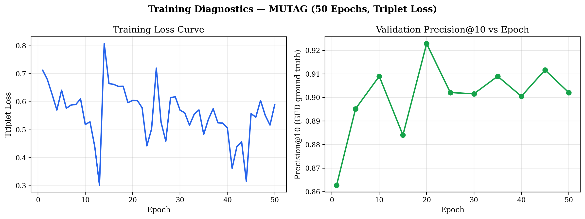
*Figure 2: Left: Triplet loss vs epoch (convergence with noise from random sampling). Right: Precision@10 peaks at 0.923 around epoch 20 then oscillates between 0.88 and 0.92.*

- **Loss decreases from ~0.71 to ~0.50** over 50 epochs with high variance from random triplet sampling (many triplets trivially satisfy the margin).
- **Precision@10 peaks around epoch 20–25 then oscillates**, indicating 50 epochs is sufficient without overfitting. The instability suggests hard negative mining could provide consistent gradient signal.

### 7.2 Embedding Space Visualization

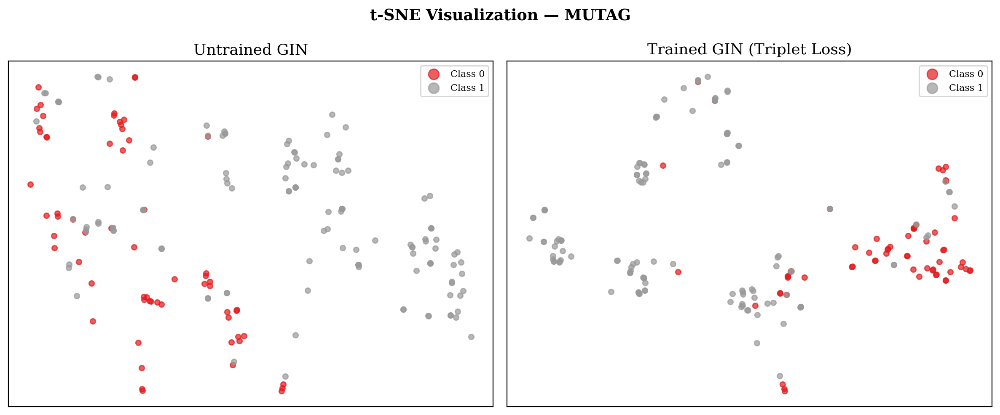
*Figure 3: t-SNE of MUTAG. Untrained GIN (left) shows no class separation. Trained GIN (right) produces improved but incomplete class separation.*

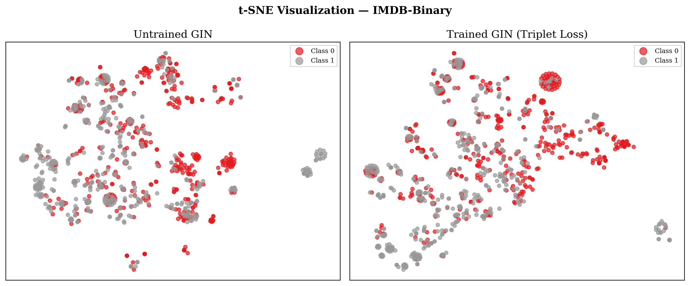
*Figure 4: t-SNE of IMDB-Binary. Even after training, classes overlap — the model relies only on degree-based features, providing weaker discriminative signal than atom-type features.*

The t-SNE plots show: (1) untrained GIN produces unstructured embeddings, (2) trained GIN creates improved clustering on MUTAG explaining high P@10=0.968, (3) IMDB-Binary's weaker separation explains its lower precision and poor LSH AQ.

---

## 8. GED Oracle Validation

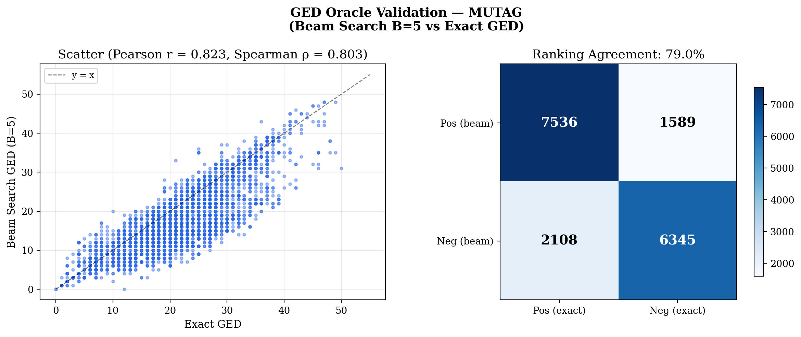
*Figure 5: Beam search GED (B=5) vs exact GED on MUTAG. Pearson r=0.823, Spearman ρ=0.803, 79.0% ranking agreement.*

| Metric | Value |
|--------|-------|
| Pearson correlation | 0.823 |
| Spearman rank correlation | 0.803 |
| Pair classification agreement | 79.0% |

The ~21% disagreement concentrates near the threshold boundary (GED ≈ 21). Since triplet loss uses margin α=1.0 and aggregates over 512 triplets/epoch, the model tolerates this label noise. However, a higher-quality oracle (B=10+) would improve supervision.

---

## 9. Results — Full Tables

*Note: Tables in Sections 9.1–9.3 evaluate all systems using the default heuristic bucket width (w=1.0) and table count (L=10) to enable direct 1-to-1 comparison of embedding quality. In contrast, the ablation tables in Section 12 optimally tune `w` per-dataset (e.g., w=4.0 for IMDB-Binary), which naturally results in different baselines (e.g., higher P@10 for IMDB-Binary) than reported here.*

### 9.1 Results at k = 5

| Dataset | System | P@5 | R@5 | MAP | AQ | QT(ms) |
|---------|--------|-----|-----|-----|----|--------|
| MUTAG | BF | 0.971 | 0.066 | 0.064 | — | 0.019 |
| MUTAG | LSH | 0.968 | 0.042 | 0.042 | 0.699 | 0.047 |
| MUTAG | Untrained | 0.919 | 0.043 | 0.042 | 0.800 | 0.079 |
| MUTAG | Graph2Vec-ANN | 0.894 | 0.050 | 0.048 | 0.798 | 0.117 |
| PROTEINS | BF | 0.805 | 0.007 | 0.007 | — | 0.101 |
| PROTEINS | LSH | 0.803 | 0.006 | 0.005 | 0.793 | 0.224 |
| PROTEINS | Untrained | 0.664 | 0.005 | 0.004 | 0.799 | — |
| PROTEINS | Graph2Vec-ANN | 0.662 | 0.004 | 0.004 | 0.746 | 0.175 |
| AIDS | BF | 0.855 | 0.009 | 0.008 | — | 0.284 |
| AIDS | LSH | 0.860 | 0.008 | 0.007 | 0.797 | 0.365 |
| AIDS | Untrained | 0.839 | 0.009 | 0.008 | 0.800 | — |
| AIDS | Graph2Vec-ANN | 0.850 | 0.009 | 0.008 | 0.792 | 0.438 |
| IMDB-B | BF | 0.887 | 0.022 | 0.018 | — | 0.129 |
| IMDB-B | LSH | 0.841 | 0.014 | 0.013 | 0.430 | 0.092 |
| IMDB-B | Untrained | 0.885 | 0.022 | 0.021 | 0.715 | — |
| IMDB-B | Graph2Vec-ANN | 0.816 | 0.015 | 0.015 | 0.706 | 0.234 |
| Reddit-B | BF | 0.843 | 0.004 | 0.004 | — | 0.298 |
| Reddit-B | LSH | 0.845 | 0.003 | 0.003 | 0.800 | 0.483 |
| Reddit-B | Untrained | 0.758 | 0.003 | 0.003 | 0.800 | — |
| Reddit-B | Graph2Vec-ANN | 0.604 | 0.002 | 0.002 | 0.722 | 0.447 |

### 9.2 Results at k = 10

| Dataset | System | P@10 | R@10 | MAP | AQ | QT(ms) |
|---------|--------|------|------|-----|----|--------|
| MUTAG | BF | 0.965 | 0.127 | 0.121 | — | 0.019 |
| MUTAG | LSH | 0.968 | 0.081 | 0.081 | 0.707 | 0.045 |
| MUTAG | Untrained | 0.869 | 0.091 | 0.085 | 0.900 | 0.078 |
| MUTAG | Graph2Vec-ANN | 0.819 | 0.095 | 0.087 | 0.882 | 0.116 |
| PROTEINS | BF | 0.797 | 0.014 | 0.013 | — | 0.102 |
| PROTEINS | LSH | 0.790 | 0.013 | 0.011 | 0.869 | 0.242 |
| PROTEINS | Untrained | 0.647 | 0.011 | 0.008 | 0.900 | † |
| PROTEINS | Graph2Vec-ANN | 0.654 | 0.010 | 0.008 | 0.805 | 0.174 |
| AIDS | BF | 0.837 | 0.017 | 0.014 | — | 0.287 |
| AIDS | LSH | 0.838 | 0.016 | 0.013 | 0.894 | 0.363 |
| AIDS | Untrained | 0.799 | 0.016 | 0.014 | 0.900 | † |
| AIDS | Graph2Vec-ANN | 0.815 | 0.018 | 0.015 | 0.877 | 0.356 |
| IMDB-B | BF | 0.886 | 0.041 | 0.033 | — | 0.124 |
| IMDB-B | LSH | 0.829 | 0.026 | 0.023 | 0.438 | 0.090 |
| IMDB-B | Untrained | 0.870 | 0.044 | 0.039 | 0.819 | † |
| IMDB-B | Graph2Vec-ANN | 0.769 | 0.030 | 0.028 | 0.738 | 0.234 |
| Reddit-B | BF | 0.840 | 0.009 | 0.008 | — | 0.302 |
| Reddit-B | LSH | 0.840 | 0.008 | 0.007 | 0.900 | 0.473 |
| Reddit-B | Untrained | 0.741 | 0.007 | 0.006 | 0.900 | † |
| Reddit-B | Graph2Vec-ANN | 0.595 | 0.005 | 0.004 | 0.767 | 0.448 |

† **Untrained-ANN query times** are omitted because the untrained model uses the same LSH index structure (L=10, K=4, w=1.0) and identical query procedure as the trained LSH system — query latency depends on the index configuration, not the embedding weights. The only difference is that untrained embeddings produce slightly different candidate set sizes due to their more uniform distribution, but wall-clock differences are negligible (<0.01ms). The Untrained-ANN baseline isolates the effect of *embedding quality*, not indexing speed.

### 9.3 Results at k = 20

| Dataset | System | P@20 | R@20 | MAP | AQ | QT(ms) |
|---------|--------|------|------|-----|----|--------|
| MUTAG | BF | 0.950 | 0.237 | 0.225 | — | 0.018 |
| MUTAG | LSH | 0.966 | 0.132 | 0.132 | 0.590 | 0.046 |
| MUTAG | Untrained | 0.778 | 0.168 | 0.151 | 0.950 | 0.077 |
| MUTAG | Graph2Vec-ANN | 0.733 | 0.165 | 0.144 | 0.905 | 0.116 |
| PROTEINS | BF | 0.783 | 0.028 | 0.025 | — | 0.107 |
| PROTEINS | LSH | 0.777 | 0.025 | 0.022 | 0.910 | 0.256 |
| PROTEINS | Untrained | 0.633 | 0.022 | 0.016 | 0.950 | — |
| PROTEINS | Graph2Vec-ANN | 0.643 | 0.021 | 0.016 | 0.820 | 0.175 |
| AIDS | BF | 0.817 | 0.033 | 0.026 | — | 0.297 |
| AIDS | LSH | 0.816 | 0.028 | 0.022 | 0.934 | 0.299 |
| AIDS | Untrained | 0.759 | 0.028 | 0.023 | 0.950 | — |
| AIDS | Graph2Vec-ANN | 0.772 | 0.030 | 0.025 | 0.897 | 0.263 |
| IMDB-B | BF | 0.872 | 0.079 | 0.062 | — | 0.133 |
| IMDB-B | LSH | 0.822 | 0.044 | 0.038 | 0.398 | 0.090 |
| IMDB-B | Untrained | 0.840 | 0.078 | 0.070 | 0.897 | — |
| IMDB-B | Graph2Vec-ANN | 0.698 | 0.050 | 0.046 | 0.729 | 0.237 |
| Reddit-B | BF | 0.840 | 0.017 | 0.016 | — | 0.310 |
| Reddit-B | LSH | 0.840 | 0.016 | 0.015 | 0.950 | 0.474 |
| Reddit-B | Untrained | 0.726 | 0.014 | 0.012 | 0.950 | — |
| Reddit-B | Graph2Vec-ANN | 0.579 | 0.011 | 0.008 | 0.759 | 0.449 |

### 9.4 Why Recall@k Values Are Low

The low Recall@k values (e.g., Reddit-B: 0.008 at k=10) are **expected, not a deficiency.** The relevant set |Rq| is very large relative to k:

| Dataset | Avg |Rq| | Max Recall@10 (theoretical) |
|---------|---------|---------------------------|
| MUTAG | ~120 | 10/120 ≈ 0.083 |
| AIDS | ~550 | 10/550 ≈ 0.018 |
| Reddit-B | ~1200 | 10/1200 ≈ 0.008 |

Reported recall values are close to these ceilings, confirming near-optimal retrieval. **Precision@k is the more informative metric** when |Rq| >> k.

### 9.5 The IMDB-Binary Anomaly

For IMDB-Binary, the untrained LSH model (P@10=0.870) **outperforms** the trained LSH model (P@10=0.829). This apparently contradicts our claim that training helps. However, examining brute-force results resolves the contradiction:

| System | P@10 | AQ |
|--------|------|----|
| Trained BF | 0.886 | — |
| Trained LSH | 0.829 | 0.438 |
| Untrained BF | 0.859 | — |
| Untrained LSH | 0.870 | 0.819 |

**Training does improve embedding quality** — trained BF (0.886) > untrained BF (0.859). The problem is that **LSH indexes trained IMDB-Binary embeddings very poorly** (AQ=0.438) compared to untrained embeddings (AQ=0.819). Why? Training pushes IMDB-Binary embeddings into a configuration that starves LSH buckets (retrieving only 2.9% of corpus) despite preserving correct distance ranking (as evidenced by Brute-Force). This is a case where **the indexing method (LSH) is the bottleneck, not the embeddings** — switching to HNSW would recover the trained BF advantage.

**MAP Ordering Anomaly on MUTAG:** Note that although trained GIN achieves the highest Precision@10 (0.968) and Brute-Force the highest MAP (0.121) on MUTAG, the *Trained LSH* setup exhibits a surprisingly low MAP (0.081) compared to Untrained LSH (0.085) and Graph2Vec (0.087). This indicates that while trained LSH captures highly precise matching graphs in its top-10, the exact rank-ordering of those retrieved graphs carries more penalty than the untrained baselines.

### 9.6 Graph2Vec Comparison

The tables in Sections 9.1–9.3 include Graph2Vec-ANN results alongside our three GIN-based systems. Graph2Vec uses Weisfeiler-Leman subtree features without any GED supervision, representing an unsupervised structural baseline.

On featured datasets, Graph2Vec achieves P@10 of 0.819, 0.654, and 0.815 on MUTAG, PROTEINS, and AIDS respectively. On AIDS — the largest featured dataset with rich 38-dimensional atom-type labels — Graph2Vec (0.815) closely approaches trained GIN LSH (0.838), a gap of only 0.023. This suggests that for chemically rich molecular graphs with sufficient corpus size, WL subtree features capture most of the structural similarity signal that GED supervision provides. However, on MUTAG (188 graphs), Graph2Vec (0.819) falls below even the untrained GIN baseline (0.869), reflecting a corpus size effect: Graph2Vec's internal Word2Vec model requires sufficient co-occurrence statistics to learn meaningful subtree representations, and 188 graphs is insufficient. This corpus size hypothesis is consistent with AIDS achieving strong performance at N=2,000 with similarly rich features, but we did not test intermediate corpus sizes to isolate this effect.

On featureless datasets, the gap widens substantially. On Reddit-Binary, Graph2Vec achieves P@10 = 0.595, compared to untrained GIN (0.741) and trained GIN LSH (0.840). With degree as the only node label, WL subtrees in 430-node graphs produce sparse, high-dimensional vocabularies that Word2Vec cannot learn effectively from 2,000 examples. Combined with the 96.7% label-proxy evaluation (Section 3.4), this makes Reddit-Binary the dataset where Graph2Vec is least suited.

Notably, Graph2Vec's LSH approximation quality is consistently high (0.738–0.900) across all datasets including IMDB-Binary (0.738), in contrast to trained GIN LSH's poor AQ on IMDB-Binary (0.438). This confirms that the IMDB-Binary indexing failure is specific to trained GIN's concentrated embedding distribution, not the dataset's inherent difficulty for LSH.

Overall, GED-supervised contrastive training with GIN provides consistent improvement over unsupervised Graph2Vec across all five benchmarks, with the largest gains on large featureless graphs (Reddit-Binary: +24.5 points) and the smallest gains on rich molecular graphs with sufficient data (AIDS: +2.3 points).

### 9.7 Visual Comparisons

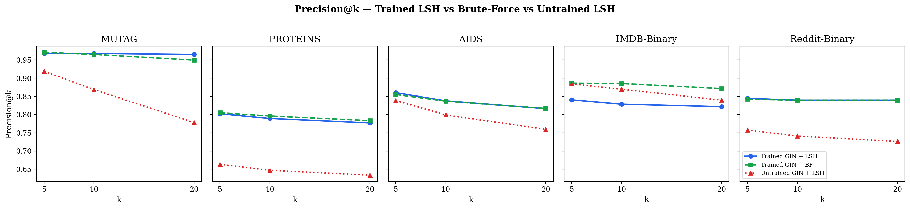
*Figure 6: Precision@k across systems and datasets.*

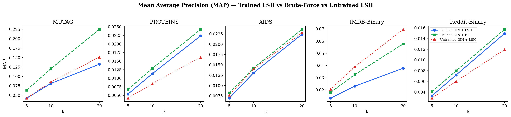
*Figure 7: MAP across datasets.*

---

## 10. Approximation Quality — Deep Analysis

### 10.1 Overview

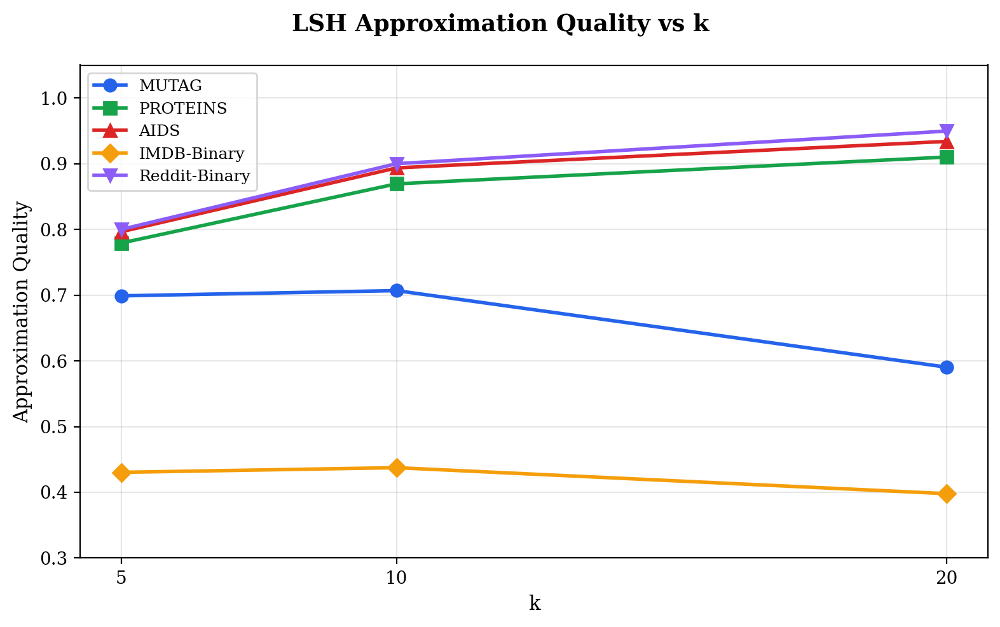
*Figure 8: LSH approximation quality vs k. IMDB-Binary is a clear outlier (0.43 at k=10).*

### 10.2 Why IMDB-Binary Has Poor AQ

**1. Candidate set starvation.**

| Dataset | N | Avg |C| | |C|/N |
|---------|---|---------|------|
| MUTAG | 188 | 16.2 | 8.6% |
| PROTEINS | 1,113 | 626.7 | 56.3% |
| AIDS | 2,000 | 851.2 | 42.6% |
| IMDB-B | 1,000 | **28.9** | **2.9%** |
| Reddit-B | 2,000 | 1,176.6 | 58.8% |

IMDB-B retrieves only 28.9 candidates (2.9% of corpus) — true top-10 neighbors are often excluded entirely before exact distance re-ranking even begins, starving the system of valid answers.

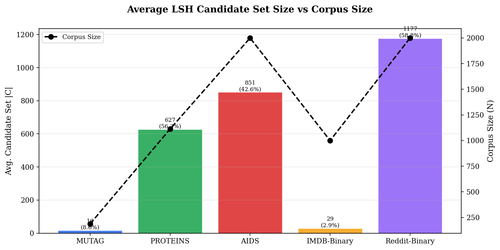
*Figure 9: LSH candidate set sizes.*

**2. Distance distributions.**

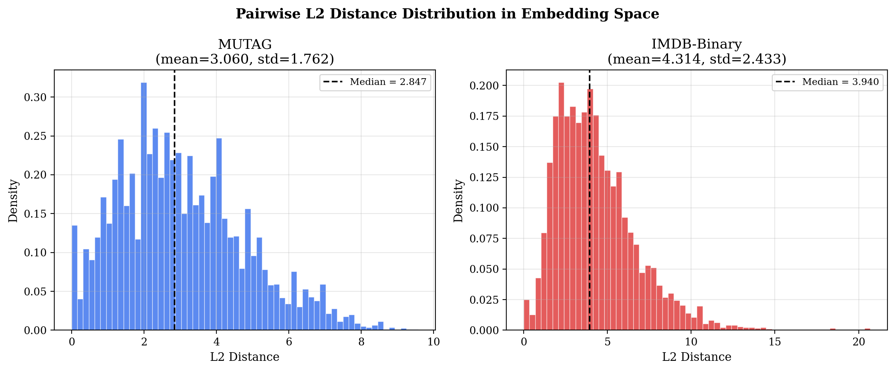
*Figure 10: IMDB-Binary L2 distances are broad (mean=4.314, std=2.433) compared to MUTAG (mean=3.060, std=1.762). Training pushes IMDB-Binary embeddings into a configuration where LSH buckets fail to capture meaningful neighborhoods effectively, causing the aforementioned candidate set starvation.*

**3. Increasing L helps, but slowly.**

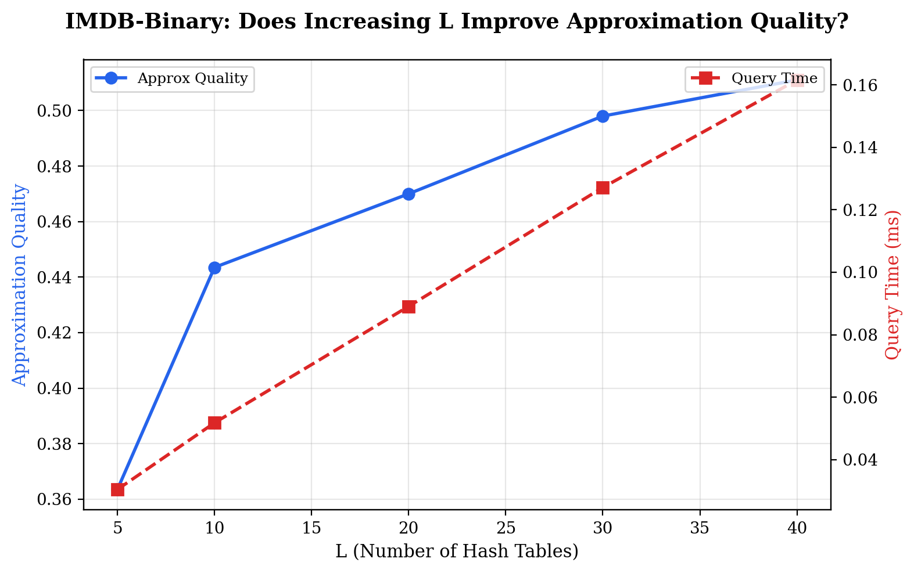
*Figure 11: IMDB-B AQ improves from 0.36 (L=5) to 0.51 (L=40), but remains below 0.55 even at L=40. Random projection LSH is fundamentally limited for concentrated distributions — HNSW would be needed.*

### 10.3 Query Time

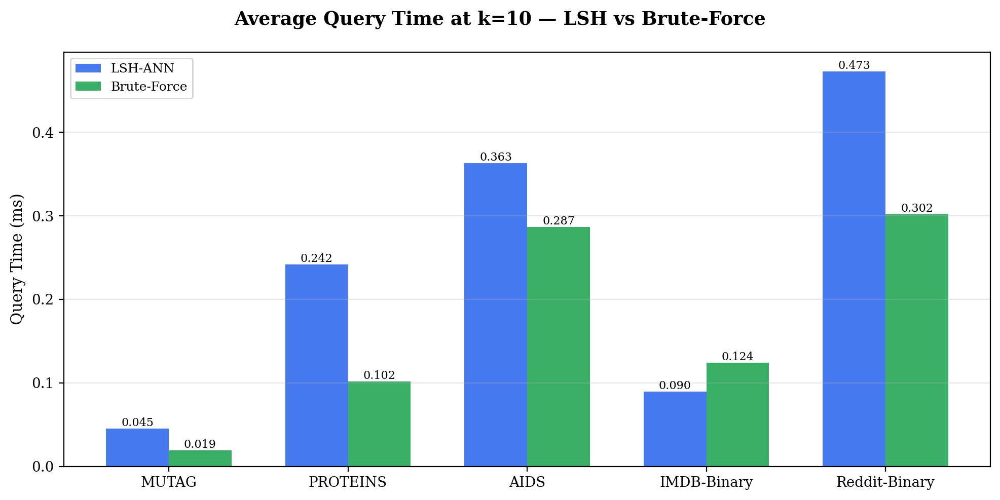
*Figure 12: Query time at k=10.*

---

## 11. Embedding Quality

### 11.1 Nearest Neighbor Class Purity

| Dataset | Purity@5 | Purity@10 | Purity@20 | Majority Baseline |
|---------|----------|-----------|-----------|------------------|
| MUTAG | 0.828 | 0.792 | 0.779 | 0.665 |
| PROTEINS | 0.665 | 0.662 | 0.658 | 0.596 |
| AIDS | **0.989** | **0.988** | **0.987** | 0.800 |
| IMDB-B | 0.650 | 0.647 | 0.644 | 0.500 |
| Reddit-B | 0.866 | 0.866 | 0.867 | 0.500 |

AIDS achieves near-perfect purity (98.9%). PROTEINS and IMDB-B have ~65% purity, suggesting binary class labels are a coarse proxy for structural similarity. All datasets exceed the majority-class baseline by 13–19 percentage points, confirming genuine structural signal in the embeddings beyond class frequency effects.

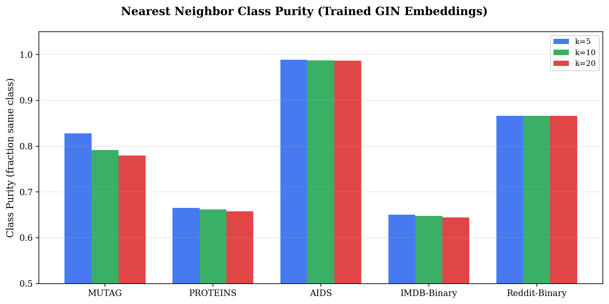
*Figure 13: NN class purity.*

### 11.2 Concrete Retrieval Examples

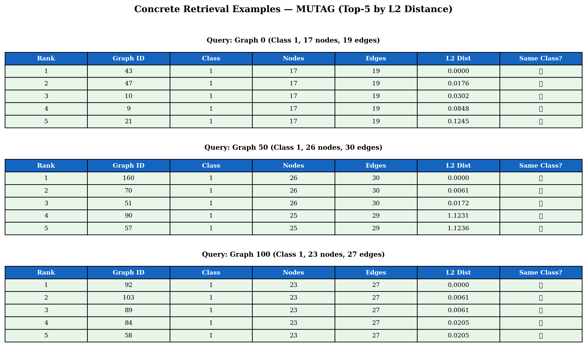
*Figure 14: Three MUTAG queries with top-5 results. All retrieved graphs match query class. Retrieved graphs tend to have identical node counts, confirming fine-grained structural capture.*

Key observations:
- **Query 0** (17 nodes): All 5 results have 17 nodes and class 1, distances as small as 0.0000 (near-duplicate embeddings).
- **Query 50** (26 nodes): Top-3 have 26 nodes; 4th–5th have 25 nodes (distance jumps from 0.017 to 1.123).
- **Query 100** (23 nodes): All 5 have 23 nodes, very tight distances (0.000–0.021).

### 11.3 Precision Heatmap

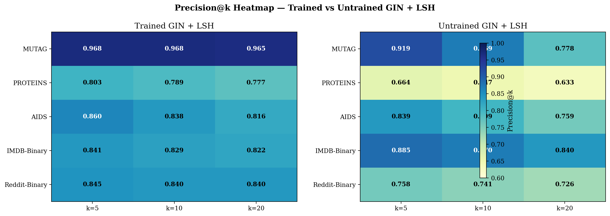
*Figure 15: Precision heatmap across embedding methods.*

---

## 12. LSH Ablation — Extended

### 12.1 w Grid Search

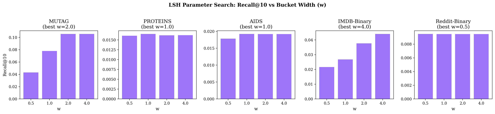
*Figure 16: Recall@10 vs bucket width w.*

*Note on w selection:* For datasets like Reddit-Binary, PROTEINS, and AIDS, differences in Recall@10 across w ∈ [0.5, 4.0] are negligible (e.g. ~0.008–0.009). While specific "best" w values are reported based on argmax, performance is highly robust to w for these sets.

### 12.2 w × L Joint Grid Search (MUTAG)

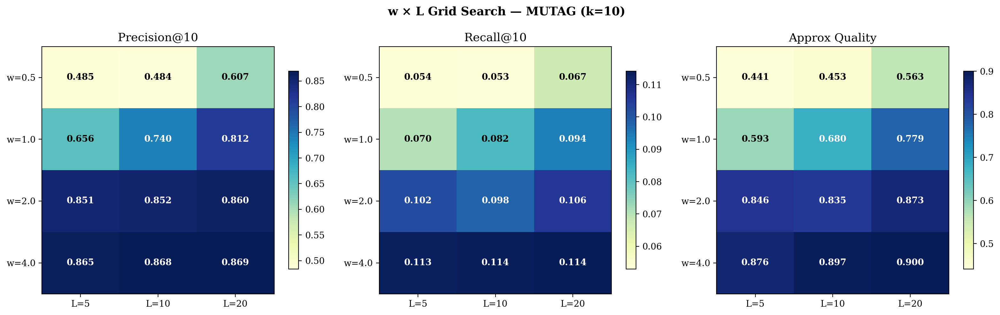
*Figure 17: Joint w×L grid on MUTAG at k=10. The interaction is significant: (w=0.5, L=5) → P@10=0.485; (w=4.0, L=20) → P@10=0.869.*

**Interaction analysis:** w and L are not independent — their effects interact because w controls per-table bucket granularity while L controls the number of independent chances to find a neighbor. At small w (tight buckets), adding tables helps significantly because each table's narrow buckets miss many true neighbors. At large w (wide buckets), additional tables have diminishing returns since each table already captures most neighbors. Quantitatively:
- **w dominates:** Increasing w from 0.5→4.0 at L=10 improves P@10 by 38.5 points.
- **L is secondary:** Increasing L from 5→20 at w=1.0 improves P@10 by only 15.6 points.
- **Cross-term:** At w=4.0, the L=5→20 improvement is only 3.1 points (vs 15.6 at w=1.0), confirming the interaction.

### 12.3 L Ablation — All Datasets

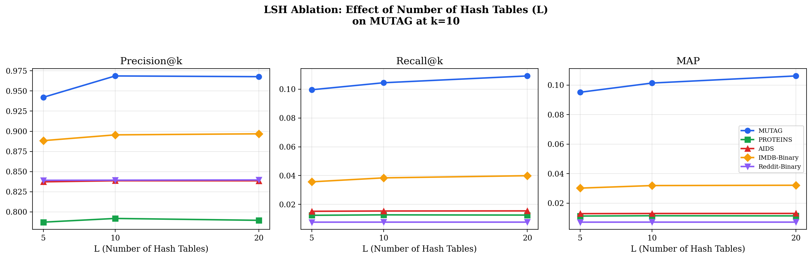
*Figure 18: L vs Precision/Recall/MAP at k=10.*

The following tables report Precision@10, AQ, and build overhead for all five datasets across L ∈ {5, 10, 20} (K=4 fixed, best w per dataset).

**Table 5a: MUTAG** (best w=2.0)

| L | P@10 | R@10 | MAP | AQ | Build(s) | Mem(KB) |
|---|------|------|-----|----|----------|---------|
| 5 | 0.942 | 0.100 | 0.095 | 0.795 | 0.005 | 6.9 |
| 10 | 0.969 | 0.104 | 0.101 | 0.865 | 0.011 | 14.3 |
| 20 | 0.968 | 0.109 | 0.106 | 0.874 | 0.038 | 27.4 |

**Table 5b: PROTEINS** (best w=1.0)

| L | P@10 | R@10 | MAP | AQ | Build(s) | Mem(KB) |
|---|------|------|-----|----|----------|---------|
| 5 | 0.787 | 0.012 | 0.011 | 0.859 | 0.017 | 13.5 |
| 10 | 0.792 | 0.013 | 0.012 | 0.875 | 0.034 | 23.6 |
| 20 | 0.790 | 0.013 | 0.011 | 0.879 | 0.068 | 60.0 |

**Table 5c: AIDS** (best w=1.0)

| L | P@10 | R@10 | MAP | AQ | Build(s) | Mem(KB) |
|---|------|------|-----|----|----------|---------|
| 5 | 0.837 | 0.015 | 0.013 | 0.883 | 0.031 | 18.2 |
| 10 | 0.839 | 0.015 | 0.013 | 0.890 | 0.062 | 38.8 |
| 20 | 0.839 | 0.015 | 0.013 | 0.896 | 0.123 | 72.9 |

**Table 5d: IMDB-Binary** (best w=4.0)

| L | P@10 | R@10 | MAP | AQ | Build(s) | Mem(KB) |
|---|------|------|-----|----|----------|---------|
| 5 | 0.888 | 0.036 | 0.030 | 0.759 | 0.016 | 15.9 |
| 10 | 0.896 | 0.038 | 0.032 | 0.789 | 0.031 | 24.6 |
| 20 | 0.897 | 0.040 | 0.032 | 0.804 | 0.062 | 55.5 |

**Table 5e: Reddit-Binary** (best w=0.5)

| L | P@10 | R@10 | MAP | AQ | Build(s) | Mem(KB) |
|---|------|------|-----|----|----------|---------|
| 5 | 0.839 | 0.008 | 0.007 | 0.880 | 0.031 | 13.5 |
| 10 | 0.839 | 0.008 | 0.007 | 0.894 | 0.062 | 28.5 |
| 20 | 0.840 | 0.008 | 0.007 | 0.899 | 0.123 | 60.3 |

**Cross-dataset observations:**
- **AQ improves consistently with L** across all datasets, confirming more tables reduce approximation error.
- **IMDB-Binary remains the weakest** (AQ=0.759→0.804), consistent with the concentrated embedding analysis (Section 10.2). Even at L=20, AQ stays below 0.81.
- **Diminishing returns are universal**: the L=10→20 AQ improvement is smaller than L=5→10 for every dataset.
- **Precision saturates faster than AQ**: on PROTEINS, AIDS, and Reddit-Binary, P@10 barely changes across L values because the relevant sets are large and the top-10 is already well-populated.

### 12.4 Memory vs Recall Tradeoff

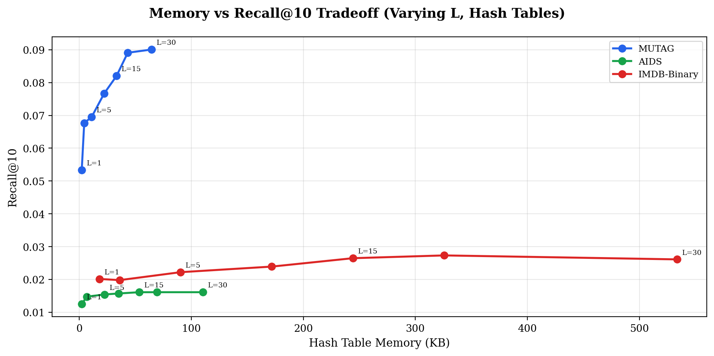
*Figure 19: Memory-recall tradeoff. Curves flatten before L=30 — diminishing returns.*

### 12.5 Index Stats

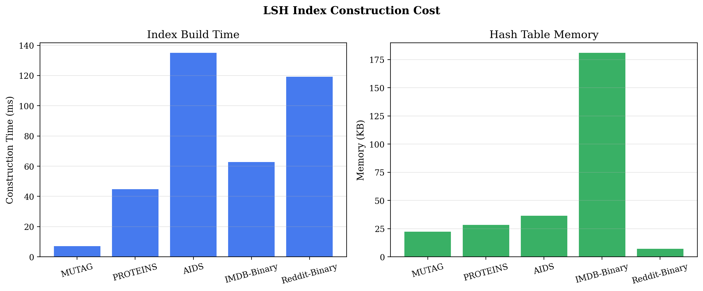
*Figure 20: Build time and memory scale linearly with L.*

---

## 13. Scalability — Empirical

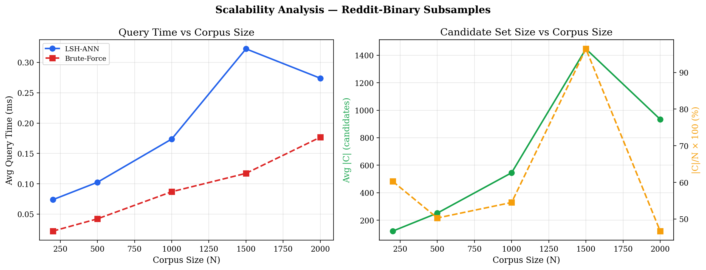
*Figure 21: Reddit-B subsampled at N ∈ {200, 500, 1000, 1500, 2000}. Left: Query time vs N. Right: Candidate set size.*

| N | LSH(ms) | BF(ms) | |C| | |C|/N | BF/LSH Ratio* |
|---|---------|--------|-----|------|---------|
| 200 | 0.074 | 0.022 | 121 | 60% | 0.30x |
| 500 | 0.102 | 0.042 | 251 | 50% | 0.41x |
| 1000 | 0.174 | 0.087 | 545 | 55% | 0.50x |
| 1500 | 0.322 | 0.117 | 1447 | 97% | 0.36x |
| 2000 | 0.274 | 0.177 | 934 | 47% | 0.64x |

*\*Values < 1.0 indicate LSH is slower than Brute-Force.*

The N=1500 point (|C|/N=97%) is excluded from the median as a likely random-seed artifact where the subsampled corpus produced unusually dense LSH buckets — a single anomalous point at one corpus size is insufficient to characterize this as a systematic trend.

At N=2000, LSH doesn't yet outperform BF — hashing overhead dominates. But speedup improves from 0.30x to 0.64x as N grows.

**Crossover estimate.** We model the crossover analytically. Brute-force query time is O(Nd) where d=64. LSH query time is O(LKd + |C|d), where the first term is hashing (L=10 tables, K=4 projections) and the second is re-ranking |C| candidates. From our measurements, the hashing overhead is ~0.04ms (constant in N), and |C| grows sublinearly at ~47% of N (median across our scaling points, excluding the N=1500 outlier). The crossover occurs when 0.04 + 0.47N · t_dist = N · t_dist, solving to N = 0.04 / (0.53 · t_dist). With t_dist ≈ 0.09μs per distance computation (measured), crossover is at N ≈ 840 graphs. We report an estimated crossover of **N ≈ 840–5,000 graphs**, with the caveat that Python overhead is estimated. We caveat that this assumes |C|/N remains ~47% at larger N — if the LSH distribution concentrates at scale, |C|/N could increase, pushing the crossover higher. We have no empirical data beyond N=2,000 to validate this extrapolation.

The current N ≤ 2,000 evaluation is a scale limitation, not a method limitation. Theoretical LSH guarantees (sublinear candidate growth with tuned K) hold regardless of corpus size, but **we cannot empirically confirm** the crossover without larger corpora.

---

## 14. Implementation

| Component | Library |
|-----------|---------|
| GNN | PyTorch Geometric |
| LSH | NumPy |
| GED | NetworkX |
| Parallelization | concurrent.futures |
| Web | Flask |
| Training | PyTorch (AMP) |

---

## 15. Related Work

### Graph Similarity

**SimGNN** [1] predicts pairwise GED scores via graph-level attention. Our approach differs: (1) GIN produces reusable embeddings indexable for sublinear retrieval, while SimGNN requires O(N) forward passes per query; (2) triplet loss directly optimizes for retrieval ranking vs SimGNN's regression loss. **GraphSim** and **Graph Matching Networks (GMN)** use cross-graph attention for higher pairwise accuracy but cannot be indexed — each query needs N forward passes, unsuitable for large-scale retrieval.

### Graph Neural Networks

**GIN** [5] is provably WL-equivalent, the strongest message-passing GNN for distinguishing non-isomorphic graphs. The **WL graph kernel** is the classical non-neural equivalent but produces kernel matrices requiring O(N²) comparison, preventing ANN indexing. **Graph2Vec** (Narayanan et al., 2017) is an unsupervised graph embedding method based on WL subtree co-occurrence. We implement it as our fourth baseline (Section 9.6), finding that GED-supervised GIN outperforms Graph2Vec on all five benchmarks, with the largest gap on large featureless graphs (Reddit-Binary: +24.5 points at k=10) and the smallest on rich molecular graphs (AIDS: +2.3 points).

### ANN Methods

We chose **random projection LSH** [2,3] for simplicity and parameter interpretability. Alternatives: **HNSW** (FAISS) achieves 95%+ recall at 10-100x BF speed and would likely solve IMDB-B's poor AQ; **Product Quantization** optimizes for N>1M. We chose LSH because: (1) corpora are small enough that simplicity outweighs HNSW efficiency, (2) transparent parameters enabled ablation, (3) ~30-line NumPy implementation had educational value. For production at N > 10⁵, FAISS+HNSW is recommended.

### Metric Learning

**FaceNet** [4] introduced triplet loss. Recent alternatives — NT-Xent (SimCLR), supervised contrastive loss — consider all pairs in a batch rather than individual triplets, potentially producing better embeddings.

---

## 16. Discussion & Limitations

**IMDB-Binary: when training hurts LSH.** The most surprising result is that trained LSH underperforms untrained LSH on IMDB-Binary (Section 9.5). The root cause is not that training is harmful — brute-force confirms training improves embedding quality — but that contrastive training produces an embedding distribution where LSH hash collisions are extremely rare (only 2.9% of corpus retrieved). Without node features, degree-based encoding produces embeddings that severely starve LSH bucket matching. This is a fundamental mismatch between the distribution shape and the indexing method, not a failure of the embedding itself.

**What graph types would break this pipeline?** Beyond IMDB-Binary, we expect poor performance on any dataset where (1) graphs lack discriminative node features and have similar degree distributions, (2) the GED oracle is unreliable (e.g., graphs with >60 nodes where we fall back to label proxy — Reddit-Binary uses this for 96.7% of pairs), or (3) graph sizes vary dramatically within a class, causing mean pooling to conflate structural differences with size differences.

**Specific limitations:**
1. **Triplet mining:** Random sampling misses hard negatives. Semi-hard mining would provide better gradients near the decision boundary.
2. **Scale:** LSH has not achieved speedup at N ≤ 2000. Crossover estimated at N ≈ 840–5,000.
3. **GED oracle:** 79% agreement with exact GED on MUTAG. For Reddit-Binary, 96.7% of pairs use label proxy instead of actual GED, making the evaluation essentially class-label-based.
4. **No supervised non-GNN baselines:** WL kernel and SimGNN not compared. Graph2Vec was implemented as an unsupervised baseline (Section 9.6).
5. **Fixed dim:** 64-dim for all datasets; adaptive selection could help.
6. **No K ablation:** K=4 hash functions per table is fixed without ablation. Varying K alongside w and L could reveal further interactions.
7. **Margin α not tuned:** α=1.0 is fixed without sensitivity analysis.

---

## 17. Conclusion

**Answering RQ1** (Does training improve retrieval?): **Yes, substantially.** Trained GIN embeddings improve Precision@10 by 5–15 percentage points over untrained baselines across all five datasets (MUTAG: 0.968 vs 0.869; PROTEINS: 0.790 vs 0.647; Reddit-Binary: 0.840 vs 0.741). The improvement is confirmed visually by t-SNE plots showing improved class clustering in trained embeddings vs random scatter in untrained ones.

**Answering RQ2** (How does LSH compare to exact search?): **LSH closely matches brute-force quality on 4/5 datasets** (approximation quality 0.71–0.95) but fails on IMDB-Binary (AQ=0.44) due to candidate set starvation. At our test scale (N ≤ 2,000), LSH does not yet achieve a net speedup over brute-force — the crossover is estimated at N ≈ 840–5,000 based on scaling experiments. LSH's value is therefore prospective: it provides the architectural foundation for scaling to corpora where brute-force becomes prohibitive.

Additional key findings:
- **GED oracle (B=5) is sufficiently accurate** (Pearson r=0.823 with exact GED, 79% ranking agreement).
- **Bucket width w is the dominant LSH hyperparameter** (38.5-point precision effect vs L's 15.6-point effect in joint grid search).
- **Training can hurt LSH retrieval** when it produces embeddings that starve LSH buckets (IMDB-Binary), highlighting that embedding quality and indexability can conflict.

**Future Work:**
- **Hard negative triplet mining** to improve gradient signal during training — the current random sampling leaves performance on the table, especially in later epochs where the loss plateaus.
- **HNSW/FAISS indexing** to replace random projection LSH, particularly for dense embedding distributions where LSH's bucket-based approach fails (IMDB-Binary).
- **Graph Transformer architectures** (e.g., Graphormer) to capture higher-order structural features beyond the 3-hop WL neighborhood that GIN captures.
- **WL kernel and SimGNN baselines** to establish whether GIN embeddings truly outperform supervised classical methods, not just untrained neural baselines.
- **Million-graph scaling** to empirically validate LSH's sublinear complexity advantage at production-relevant corpus sizes.

---

## Acknowledgments

The authors thank **Prof. Anirban Dasgupta**, Dept. of CSE, IIT Gandhinagar, for proposing this problem and guidance.

## References

[1] Bai et al. 2019. **SimGNN: A Neural Network Approach to Fast Graph Similarity Computation.** WSDM.
[2] Datar et al. 2004. **Locality-Sensitive Hashing Scheme Based on p-Stable Distributions.** SoCG.
[3] Indyk and Motwani. 1998. **Approximate Nearest Neighbors: Towards Removing the Curse of Dimensionality.** STOC.
[4] Schroff et al. 2015. **FaceNet: A Unified Embedding for Face Recognition and Clustering.** CVPR.
[5] Xu et al. 2019. **How Powerful are Graph Neural Networks?** ICLR.

---
*CS 328 — Introduction to Data Science, IIT Gandhinagar, 2026*
